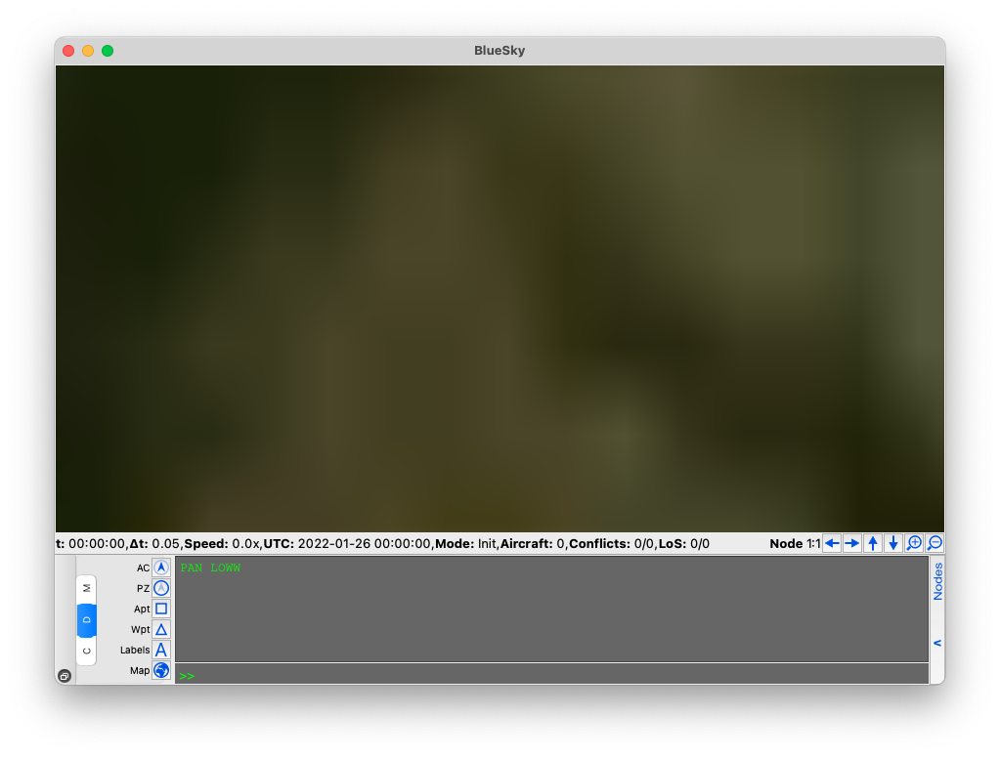
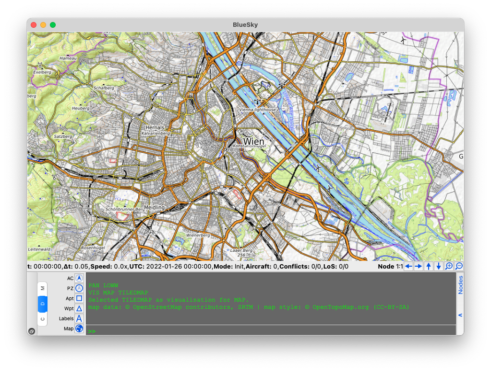
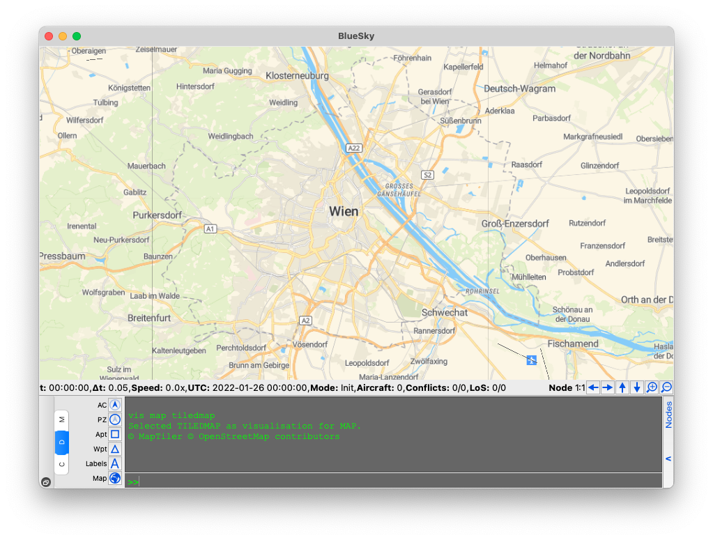
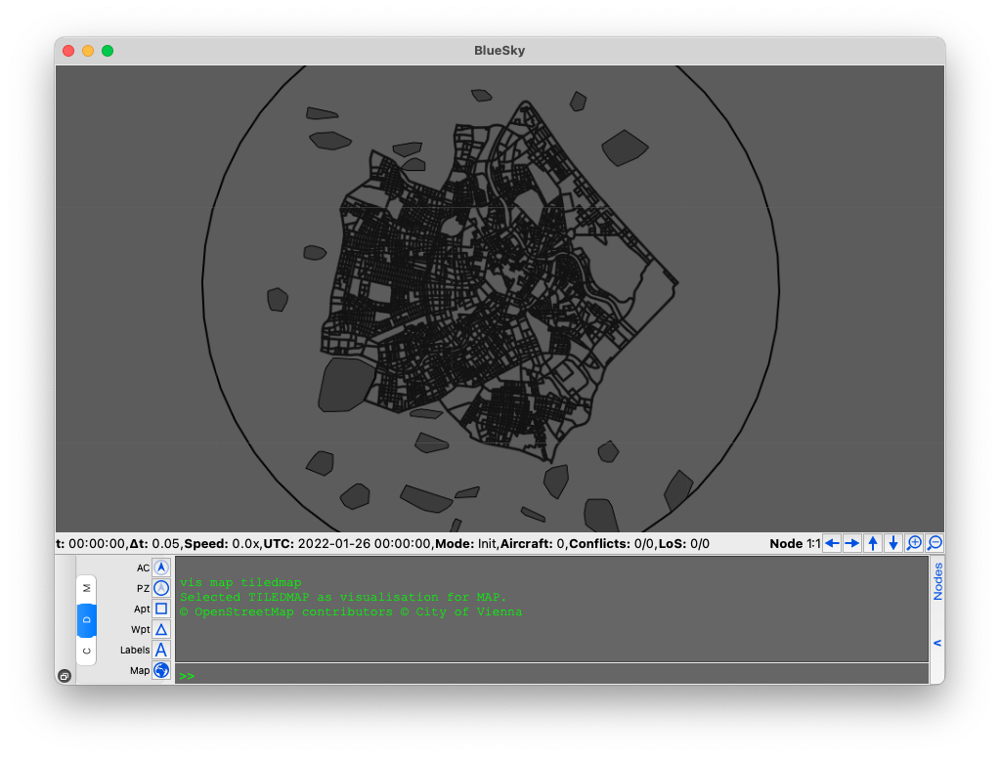
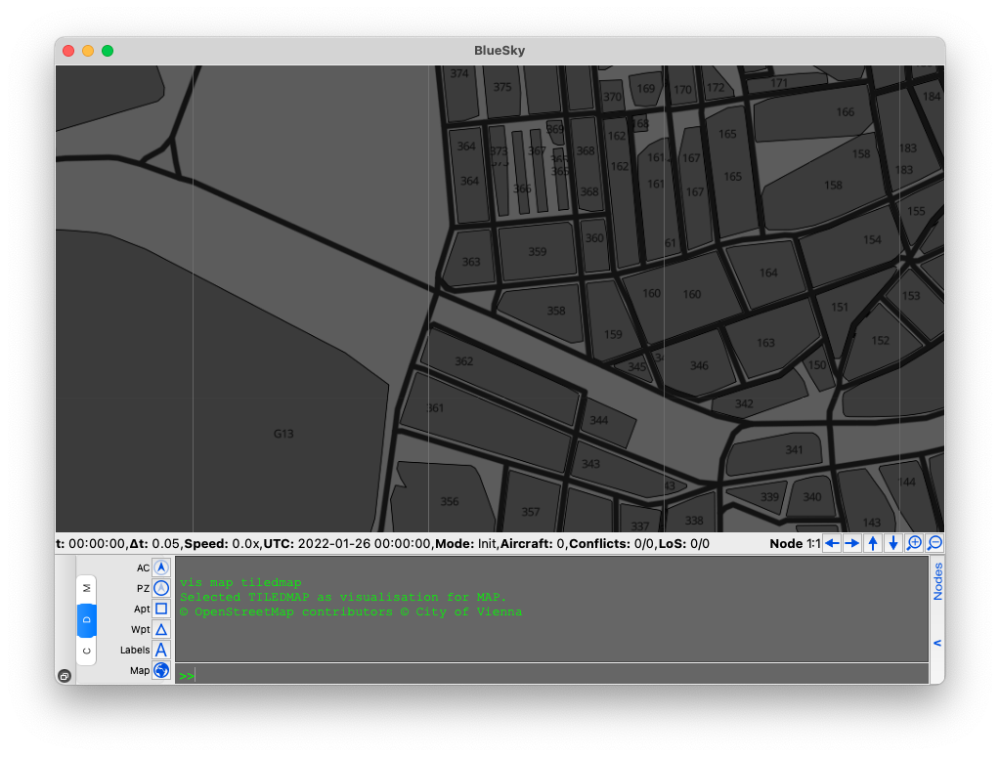

Serve the tiles to BlueSky
===================================

All that is left to do is to serve our tiles to `BlueSky <~/bluesky-maptiles-docs/docs/>`_.

For traditional Air Traffic Control simulations it is typically not necessary to see city level details.

This is why the default BlueSky background is one large texture of the world.

.. image:: ../images/bluesky_default.png
   :width: 900

However, this for Urban Air Mobility simulations it is not very useful because at the city level you do not see any details
about the city.

Showing a tiled map in BlueSky
------------------------------------
Starting in 2021, there has been a concerted effort by the developers of BlueSky to make it the go-to Air Traffic Control Simulator
for Urban Air Mobility. One of the important developments was the integration of tiled maps in to BlueSky.

To see the tiled map, just run the following on the BlueSky console,

.. code-block::

    VIS MAP TILEDMAP

The default BlueSky tiled map is `OpenTopoMap <https://opentopomap.org/about>`_ because the tiled map is open source.

Adding a different XYZ map
---------------------------
BlueSky is able to add any tiled map as long as they stick to the Slippy map convention. At the moment it is only able
to add raster tiles. For a full list of available XYZ providers refer to `xyzservices <https://xyzservices.readthedocs.io/en/stable/>`_
by GeoPandas.

You can add any tiled map to BlueSky by adding some information to the :code:`settings.cfg` file

.. literalinclude:: ../configs/settings.py
  :language: python

You can have a several tile_sources stored in a dictionary called :code:`tile_sources`. 
The variable :code:`tilesource` decides which entry to use. I like to use maptiler
because they offer many free requests per month, all you need is to get an api key and add it
to the end of the :code:`source` url.

Adding an XYZ map from TileServer GL
-------------------------------------
TileServer GL also provides XYZ services so it is also possible to add this to BlueSky.
Once the server is running, visit the homepage and click the XYZ button under the :code:`m2` style.
This will give you the following link,

`<http://localhost:8080/styles/m2/{z}/{x}/{y}.png>`_

Now you can add this source :code:`settings.cfg`. However, first you must change the :code:`{z}` to :code:`{zoom}`.
We added a license contribution to City of Vienna and OpenStreetMap since that is where the data comes from.

.. literalinclude:: ../configs/settings2.py
  :language: python

Now with the :code:`m2` we see

And zoomed we can see the building and geofence ids!

