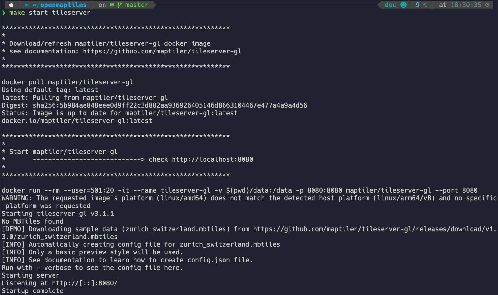

Serving the tiles
===================================

The goal of this section is to serve as a general tutorial of how to work with 
OpenMaptiles, TileServer GL, and maputnik. This will for sure not be an comprehensive tutorial and
will only show enough for our purposes.

Working with OpenMapTiles and TileServer GL
----------------------------------------------
Per their documentation "OpenMapTiles is an extensible and open tile schema based on the OpenStreetMap. 
This project is used to generate vector tiles for online zoomable maps. 
OpenMapTiles is about creating a beautiful basemaps with general layers containing topographic information".

OpenMapTiles provides a simple way to download OSM data and create maps. In simple words they convert OSM data
into :code:`mbtiles`. OpenMapTiles organizes the vector tiles into a `schema <https://openmaptiles.org/schema/>`_ that
makes it simple to style. It is also possible to make custom layers from OSM data. `Here <https://github.com/openmaptiles/openmaptiles-skiing>`_ 
is a nice example.

However, for this tutorial we won't really focus on these capabilties as we do not want our data to come directly from OSM. 
In Metropolis-2, we modified streets and buildings to ensure they are usable in BlueSky.
Downloading OpenMapTiles also brings TileServer GL. It is also possible to skip OpenMapTiles and just 
download TileServer GL but we will not. Note that both will require installing `docker <https://www.docker.com/>`_.

Start the server
*****************
OpenMapTiles brings in a lot of `commands <https://github.com/openmaptiles/openmaptiles#develop>`_ that are used for creating and
serving the tiles. To create a tile server it is as simple as just running :code:`make start-tileserver` in the root directory
of :code:`openmaptiles`. This should give you something similar to this:

The output gives us a couple clues as to how the tile server works.

* The tile server is at :code:`http://localhost:8080`.
* A docker command is executed :code:`docker run --rm --user=501:20 -it --name tileserver-gl -v $(pwd)/data:/data -p 8080:8080 maptiler/tileserver-gl --port 8080`
* No :code:`mbtiles` file was found so :code:`zurich_switzerland.mbtiles` was downloaded.
* A :code:`config.json` file was automatically created.
* This `basic preview <https://github.com/openmaptiles/maptiler-basic-gl-style>`_ style is used.
* Running with :code:`--verbose` will give us information about :code:`config.json`.

Visiting :code:`http://localhost:8080` in a web browser will show us the tile server. 
There are two important sections styles and data.
 
 .. image:: ../images/tileserver.png
   :width: 900

The config file
*****************
The TileServer GL `documentation <https://tileserver.readthedocs.io/en/latest/config.html>`_ 
shows all the possible options for the :code:`config.json` file. However, running the docker command
from the output above with :code:`--verbose` will show the one used by :code:`make start-tileserver`.

.. code-block::

   docker run --rm --user=501:20 -it --name tileserver-gl -v $(pwd)/data:/data -p 8080:8080 maptiler/tileserver-gl --port 8080 --verbose

This returns a slightly longer output with the :code:`config.json` file.
 
 .. image:: ../images/config.png
   :width: 900

The :code:`config.json` file is as follows.

.. literalinclude:: ../configs/default_config.json
  :language: JSON

There important parts of the config file are (1) **options**, (2) **styles**, (3) **data**.

For this tutorial we will only work with the parts shown in the default :code:`config.json`. 
Now that we have all the data the most difficult part is pretty much done. The trick now
is to get the paths right inside **options**. In the current config, the root directory is somewhere inside our docker shell.

If we open a new terminal and enter the docker shell, we can navigate to the root directory.

 .. image:: ../images/docker_root.png
   :width: 900

The other paths (:code:`fonts`, :code:`styles`, and :code:`mbtiles`) are dependent on the :code:`root` path. 
For example to navigate to :code:`fonts` we would have to visit :code:`/app/node_modules/tileserver-gl-styles/fonts` 
You can see this directory in the image above. It is the sames for :code:`styles`. However, if you take a look at the image above
you won't find the :code:`mbtiles` path because the path starts with a forward slash (:code:`/`). In this case it means that we
need to look inside the :code:`/data/` directory of the docker shell.

 .. image:: ../images/docker_root_data.png
   :width: 900

This :code:`data` directory inside the docker shell is actually just a copy of :code:`openmaptiles/data`.

In the future this is where we will place our vector tiles, style schema, and fonts 
(you can also put some sprites there but we will not be doing that in this tutorial).

About fonts
*****************

If you visit the :code:`/app/node_modules/tileserver-gl-styles/fonts` directory in the docker shell you 
will see a :code:`Noto Sans Regular` font directory with a bunch of :code:`pbf` files.
These are the default fonts of the server. If a custom style references a non existent font,
the server will use the default font. For most of my cases, the default is fine.

However, to use other fonts we can look at at the OpenMapTiles `font <https://github.com/openmaptiles/fonts>`_ 
repository and either:

* package the fonts.
* set :code:`"glyphs": "http://fonts.openmaptiles.org/{fontstack}/{range}.pbf"` in the style schema.
  
Since we are attempting to do everyhting locally, we will package the fonts following 
these `instructions <https://github.com/openmaptiles/fonts#package-the-fonts>`_.

See TileServer GL documentation for more information.

About styles
*****************

If we look again at the :code:`config.json` file we see the :code:`basic-preview` style located at
:code:`/app/node_modules/tileserver-gl-styles/styles/basic-preview/style.json`. It also
has some information about the bounding box of the tiles (not required but nice).

The :code:`style.json` is almost a complete copy of of `this <https://github.com/openmaptiles/maptiler-basic-gl-style/blob/master/style.json>`_.
The only difference are the paths to the vector tiles and glyphs. The online version is linking to
the MapTiler server, while the one in the docker shell is linking to a local path. You can actually
use any path (local or remote), however some paths may require an api key (mapbox or MapTiler).
Below you can see just the top of the :code:`style.json` file in the docker shell.

.. literalinclude:: ../configs/basic.json
  :language: JSON

Under :code:`sources` you can see that the OpenMapTiles vector tiles are linked to the local tiles :code:`v3`.
Looking at the :code:`config.json` above we can see that those are the :code:`zurich_switzerland.mbtiles`.

The :code:`glyphs` path is set to :code:`{fontstack}/{range}.pbf` which means that the font will depend on whatever
the layer (more on this later) uses. The basic preview style only uses the :code:`Noto Sans Regular` font which comes packacged with
OpenMapTiles.

.. note::

   `OpenMapTiles <https://openmaptiles.org/styles/>`_ provides several open source styles that are a good starting point for beginners.

About sprites
*****************
The Metropolis-2 tiles will not be using sprites but it is worth briefly mentioning them.

The `dark matter style <https://github.com/openmaptiles/dark-matter-gl-style/blob/master/style.json>`_ provides an example
path to sprites.

.. code-block::

   "sprite": "https://openmaptiles.github.io/dark-matter-gl-style/sprite"

When a style contains a reference to a sprite it will try to look in this path. The documentation for sprites says
that the following files be present, :code:`sprite.json`, :code:`sprite.png`, :code:`sprite@2x.json`, :code:`sprite@2x.json`.
If you add these file extensions to the sprite path of the dark matter style you can see how they look.

* `<https://openmaptiles.github.io/dark-matter-gl-style/sprite.json>`_
* `<https://openmaptiles.github.io/dark-matter-gl-style/sprite.png>`_
* `<https://openmaptiles.github.io/dark-matter-gl-style/sprite@2x.json>`_
* `<https://openmaptiles.github.io/dark-matter-gl-style/sprite@2x.png>`_

As always you can also reference them locally.

Creating a custom style with maputnik
--------------------------------------

Bringing it all together
--------------------------------------
