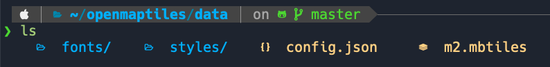
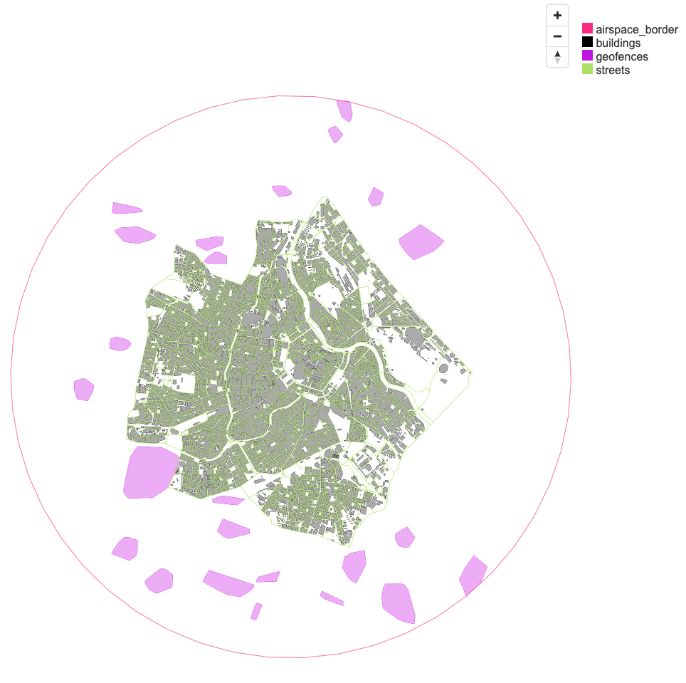
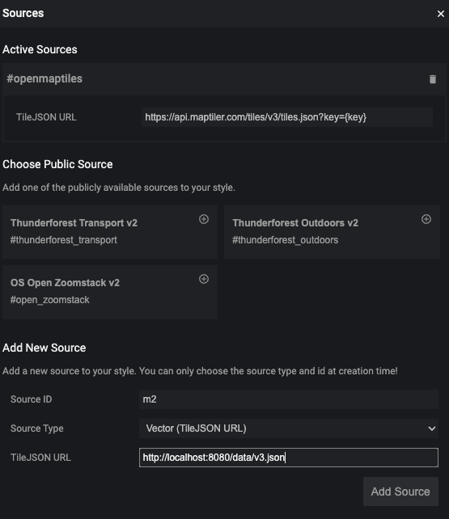
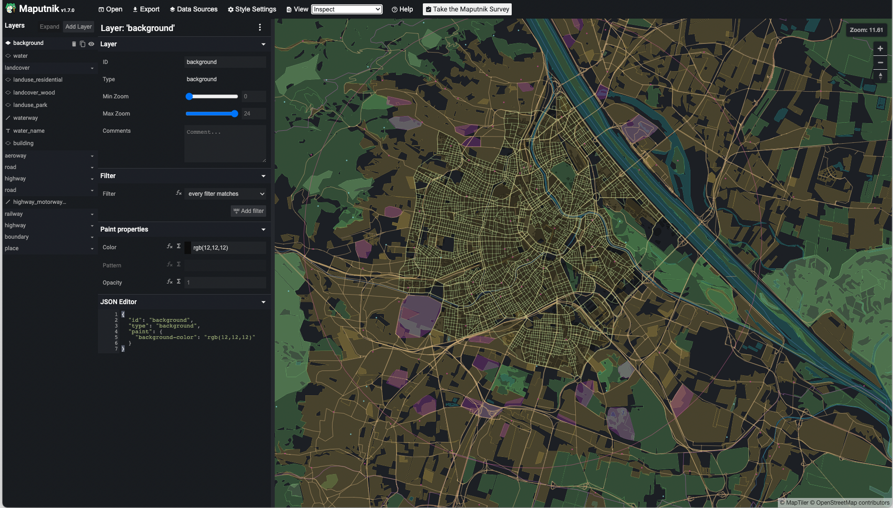
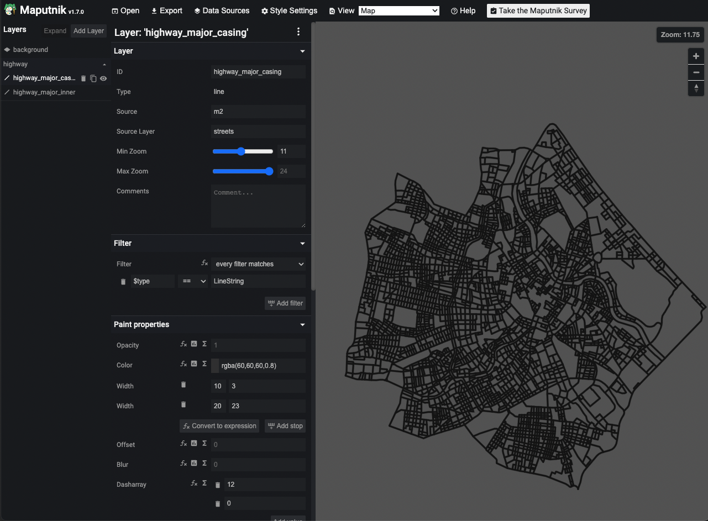
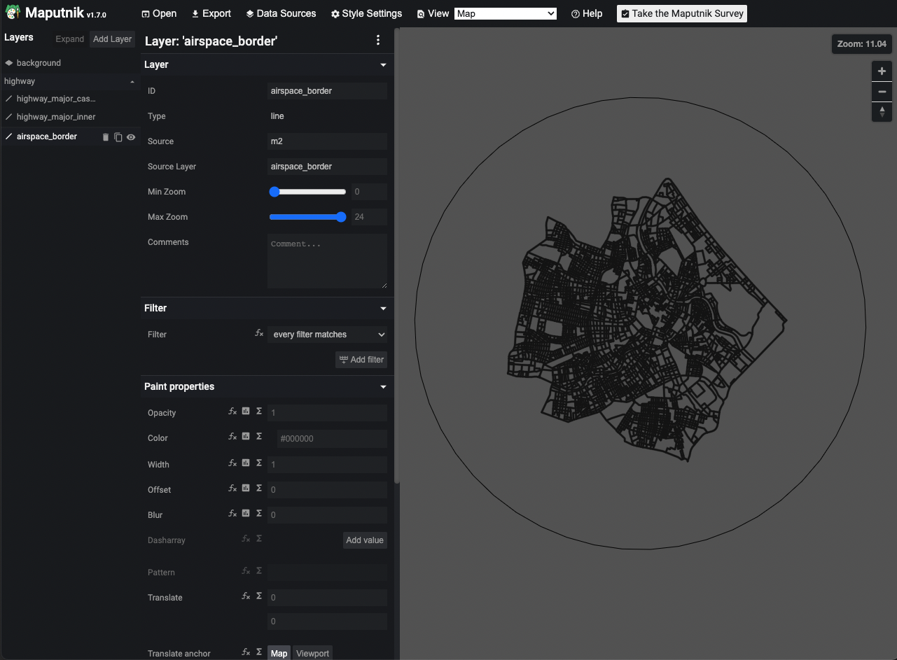
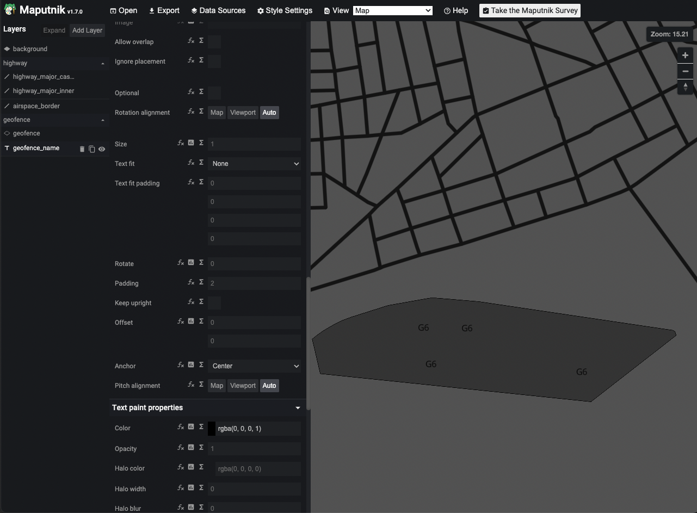
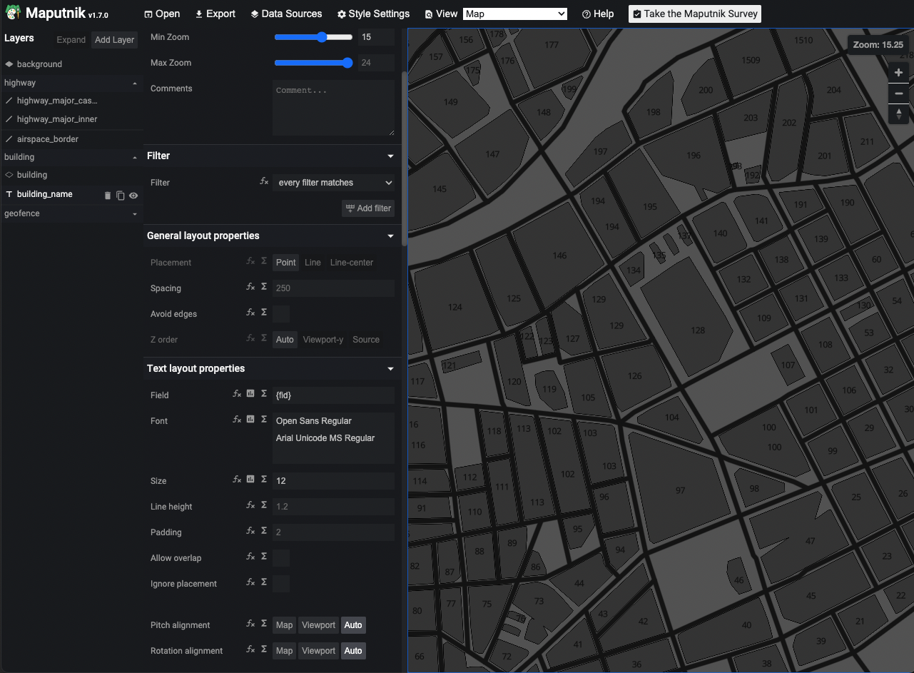
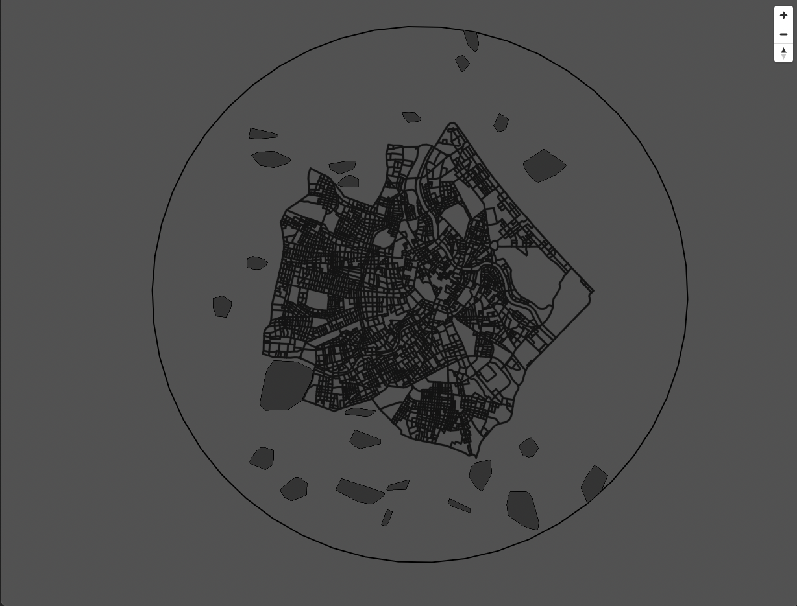

Creating the Metropolis-2 style
===================================

There is already a nice tutorial on how to use `maputnik <https://github.com/maputnik/editor/wiki>`_ for custom styles.
It has an online version that can sync with your local :code:`style.json`. The benefit is that if you just create
a vanilla :code:`mbtiles` file with OpenMapTiles then you can design your style without adding your local :code:`mbtiles`
to maputnik becuase maputnik can serve tiles from MapTiler without an api key. However, when serving with TileServer GL
you need to replace the tile source, sprites, and glyphs paths with a local path or get a MapTiler api key.

.. note::

   `OpenMapTiles <https://openmaptiles.org/styles/>`_ provides several open source styles that are a good starting point for beginners.
   These can be loaded directly into maputnik.

   You can use any tiles in maputnik as long as they adhere to the :code:`mbtiles` convention. 
   I alternate between mapbox and MapTiler. However a MapTiler style is not compatible with a mapbox style
   even if they both use OpenStreetMap as they have different layers.

For Metropolis-2, it is not possible to design the style this way because it does not use the same layer schema
as OpenMapTiles or Maptiler. Since, we modified the data considerably we need to add them as a source.

Adding our local tiles to maputnik
------------------------------------

There is no way to directly add :code:`m2.mbtiles` as a source to maputnik. Among other things, it accepts :code:`GeoJSON` and :code:`TileJSON`
but not :code:`mbtiles`. Luckily, TileServer GL can serve an :code:`mbtiles` file as a TileJSON. If you look at the image
of the TileServer GL homepage above you can see that there is a TileJSON button. If you click that and get the url it looks like this:

`<http://localhost:8080/data/v3.json>`_

So ideally, we can now add this url to maputnik and see our data. However, to do this we need the local `maputnik CLI <https://github.com/maputnik/editor/wiki/Maputnik-CLI>`_
because the online editer only works with Hypertext Transfer Protocol Secure (:code:`https`). So unless you serve the tiles to a public url
you will not be able to see the data.

Serve a TileJSON
******************

Now we are ready to serve the Metropolis-2 tiles to start designing our style.

So at this point we can make changes to :code:`openmaptiles/data` before starting the server.

Step 1
^^^^^^^^^^^^^^^^^^
Place :code:`m2.mbtiles` in :code:`openmaptiles/data`

Step 2
^^^^^^^^^^^^^^^^^^
Place the following :code:`config.json` in :code:`openmaptiles/data`

.. literalinclude:: ../configs/server.json
  :language: JSON

Note how that by setting :code:`"root": ""` the root directory will be inside :code:`/data/` in the docker container.

Step 3
^^^^^^^^^^^^^^^^^^
Make a directory called :code:`fonts` in :code:`openmaptiles/data` and copy the fonts created with OpenMaptiles fonts.

Step 4
^^^^^^^^^^^^^^^^^^
Make a directory called :code:`styles` in :code:`openmaptiles/data`. It can remain empty for the time being.

At this point your :code:`openmaptiles/data` directory should look like this:

Step 5
^^^^^^^^^^^^^^^^^^
Start the server by running :code:`make start-tileserver` in :code:`openmaptiles`. 
Now visit `<http://localhost:8080>`_ and you should only see your data. If you click "inspect" you should see
something like this 

Note the 4 available layers in the top right and how you can hover over the geometry to get more information.

Step 6
^^^^^^^^^^^^^^^^^^
In the home page of the server you can now find the link to the TileJSON:

`<http://localhost:8080/data/v3.json>`_

Note how it is an :code:`http` url.

Add :code:`http` url as a source in maputnik
******************************************************
Now that the server is running with the Metropolis-2 tiles, we can add it as a source to maputnik.
The Metropolis-2 style will be inspired by the dark matter style from OpenMaptiles.

Step 1
^^^^^^^^^^^^^^^^^^
Download the dark matter :code:`style.json` from github

`<https://github.com/openmaptiles/dark-matter-gl-style/blob/master/style.json>`_

then place it inside :code:`openmaptiles/data/styles`.

Step 2
^^^^^^^^^^^^^^^^^^
Change line 2 to :code:`"name": "m2",`

Step 3
^^^^^^^^^^^^^^^^^^
Assuming you have installed the Maputnik-CLI correctly run :code:`maputnik --watch --file style.json`
from :code:`openmaptiles/data/styles`. This will make sure any changes made in maputnik are saved
to your file. 

If it went well, you can now visit

`<http://localhost:8000>`_

and you will see the maputnik editor with the dark matter style.

Step 4
^^^^^^^^^^^^^^^^^^
Click **Data Sources** at the top of the page and add the the source in the pop-up window.

If you click **View** at the top and select *Inspect* and then navigate to Vienna you will see our Data
overlayed with the MapTiler data. 

.. note::

   We could already remove the openmaptiles source. However, because all the style layers reference it, removing it would
   give us a big error and make it difficult to style.

   For the time being it is better to modify the style layers.

Make style layers
------------------------------------
Now we can start making our styling layers which will reference the :code:`mbtiles` layers

* **airspace_border**
* **buildings**
* **geofences**
* **streets**

There are already some good tutorials for styling with maputnik on their github so I will not spend
too much time describing it.

Here I will go over the main general steps for the Metropolis-2 style.

Streets layer
************************************

For this layer I just slightly modified two style layers

* :code:`highway_major_casing`
* :code:`highway_major_casing`

This involved:

#. changing the source to :code:`m2` and the source layer to :code:`streets`.
#. removing the class filter.
#. Makinf the backgrounda little lighter.
#. Change the minimum zoom to 9.

I then deleted the rest of the layers. Now everything is referencing :code:`m2` so I can remove the OpenMaptiles source.

Airspace border layer
************************************
The airspace border is just a simple line. The main thing is that I want it to be available at all zoom levels.

Geofence layer
************************************
This will require two style layers. One for the geometry and one for the label of the geofence.

For the geometry, all we need to do is create a fill layer add an outline color and make it available to a minimum of zoom 8.

For the label, we use the **id** property and make it available only when zoomed in to at least a zoom level of 15.

The font, **Open Sans Regular**,  is located at :code:`openmaptiles/data/fonts`.

Building layer
************************************
The building layer is pretty much the same as the geofence layer. The main difference is that the geometry and labels are only visible
at a minimum zoom level of 15.

In this case the label is called **fid**.

Maputnik saves the :code:`style.json` automatically so we can close a maputnik and our data tile server.

Serving the styled tiles
------------------------------------

At this point we have a working style for the :code:`m2.mbtiles` However, the :code:`config.json` and :code:`style.json` 
are still not ready for TileServer GL.

Final touches to :code:`style.json`
************************************

After playing with the style schema in maputnik there are still some small changes needed to make sure the tile server works.

#. Ensure the name is :code:`m2`
#. Change the sources url to :code:`"url": "mbtiles://{v3}"`
#. Change the glyphs to :code:`"glyphs": "{fontstack}/{range}.pbf"`
#. Delete the :code:`sprites` entry.
#. Change the id entry to :code:`"id": "m2"`
#. Delete the metadata entry (not required)

The :code:`style.json` file ends up like this,

.. literalinclude:: ../configs/style.json
  :language: JSON

Final touches to :code:`config.json`
**************************************

Now we need to add a style entry so the tile server can use our m2 style.

This final config file looks like this,

.. literalinclude:: ../configs/config.json
  :language: JSON

Serve the final tiles
**************************************

After modifying the schema we can restart the tile server by running :code:`make start-tileserver`
from :code:`openmaptiles`.

And if we go to the viewer we can see our scrollable Metropolis-2 map!

