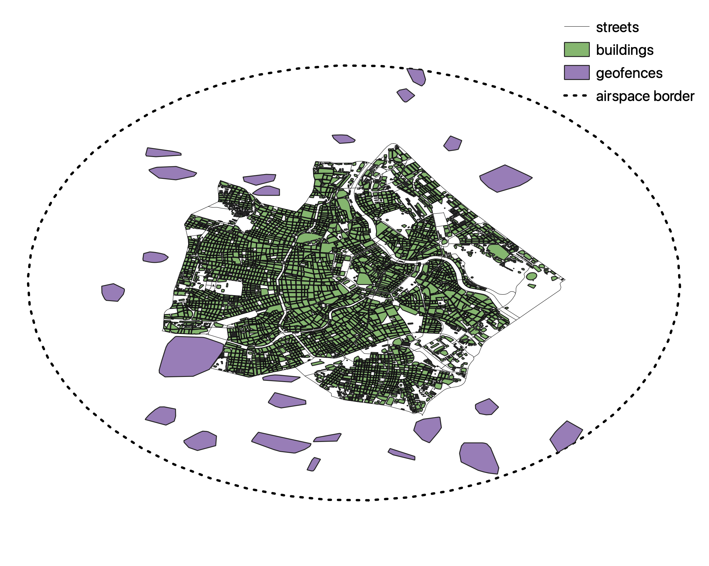
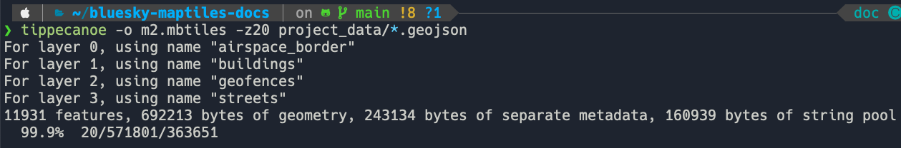

Custom tiles
===================================

The goal of this section will be to show how to create an :code:`mbtiles` file from Metropolis-2 Data.
At the end we will get a nice `Slippy Map <https://wiki.openstreetmap.org/wiki/Slippy_Map>`_ that we can
show in BlueSky. Read this MapTiler `article <https://www.maptiler.com/google-maps-coordinates-tile-bounds-projection/#3/15.00/50.00>`_ 
for more information about zoomable maps.

The street data came from `OpenStreetMap <https://www.openstreetmap.org/>`_ and 
was downloaded via `OSMnx <https://github.com/gboeing/osmnx>`_.

The building data comes from the `City of Vienna <https://www.wien.gv.at/english/>`_. 
Please refer to the `building data processeing <https://github.com/Metropolis-2/building-data-processing>`_
page of Metropolis-2 for more details.

The geofence locations were chosen with OSM at cemetaries, parks, and other green areas of Vienna.

Finally, the airspace border was selected to be an 8 km radius circle centered in the middle of Vienna.

.. note::

   Check out this cool 3d model of our `M2 simulation area <https://bluesky-maptiles-docs.readthedocs.io/en/latest/3dview.html>`_.
   With maptiles by MapTiler and OpenStreetMap.

Note that each dataset may contain information about each individual item. In Metropolis-2 we are
interested in seeing which buildings or geofences are intruded by aircraft. Therefore 
we may want to show that information in BlueSky. The geofence and building data is structured as follows:

.. list-table:: Geofence and Building data structure
   :widths: 25 25 50
   :header-rows: 1

   * - fid
     - height
     - geometry
   * - 1
     - 250
     - Polygon
   * - 2
     - 500
     - Polygon

The goal will be to show the :code:`fid` of the individual building when zoomed in.

Creating the tiles with tippecanoe
----------------------------------
OpenMapTiles and TileServer GL both work with the :code:`mbtiles` `specification <https://docs.mapbox.com/help/glossary/mbtiles/#:~:text=MBTiles%20is%20a%20file%20format,from%20many%20different%20data%20sources.>`_ from mapbox.
So we will have to convert our data into this format. QGIS has an `algorithm <https://docs.qgis.org/3.16/en/docs/user_manual/processing_algs/qgis/vectortiles.html?highlight=xyz%20tiles>`_ to create vector tiles, however at the
time of this tutorial the vector tiles did not render correctly for the street geometry.

Therefore, we will use tippecanoe from mapbox to generate the tiles.

The first step is to convert all datasets into `GeoJSON <https://geojson.org/>`_ format. 
This can easily be done with QGIS. It is also important to set the coordinate reference system to EPSG:4326. 
The four GeoJSON files are saved in the :code:`project_data` directory.

The second step is to create the tiles with the :code:`tippecanoe` command. 
The documentation shows the many different options of the command.
For this tutorial, run the command below from the root directory of :code:`bluesky-maptiles-docs` 
to create :code:`m2.mbtiles` to zoom level 20.

.. code-block::

   tippecanoe -o m2.mbtiles -z20 project_data/*.geojson

If it all goes well you should get the following output and the :code:`m2.mbtiles` ready to go.

